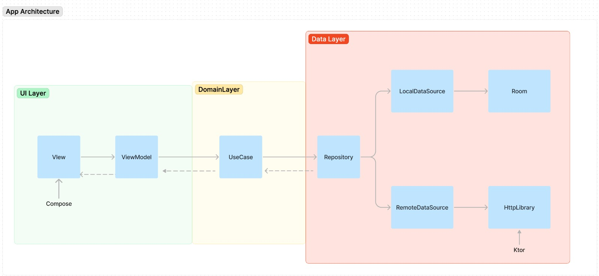

# Compass Challenge

## Proposed App Architecture

I focused on architecture implementation since there wasn't a provided design. I'm assuming this would be part of a bigger project in order to justify the architecture decision. It could have be done way easier if specified the opposite.
Room was used mainly because the site was about 270kb and it wouldn't fit on SharedPrefs, that would be the fastest way.

### Out of scope
* A TTL could be added at the cache layer to make sure the data isn't "dirty".
* Error handling could (and should) be improved